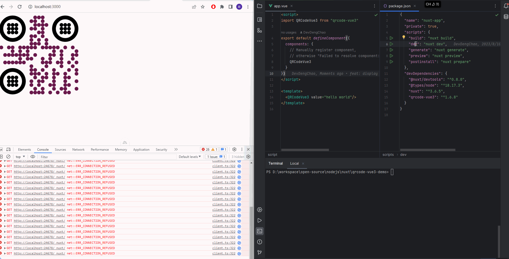
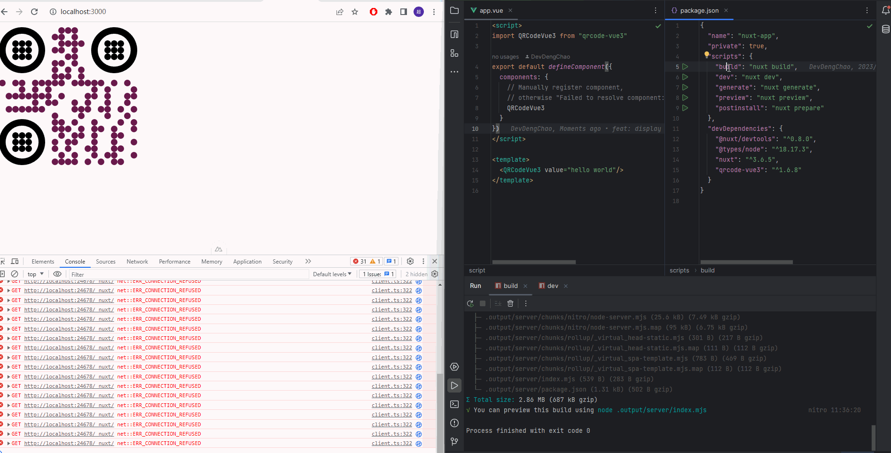

# QRCodeVue3 Nuxt3 build and preview issue example

This repository shows that https://github.com/scholtz/qrcode-vue3 works fine in Nuxt3 app when running dev task, but
failed when running build and preview task.

+ dev: 
  

+ build + preview:
  

The error message is:

> [nuxt] [request error] [unhandled] [500] The requested module 'qrcode-vue3' does not provide an export named 'default'
at ModuleJob._instantiate (node:internal/modules/esm/module_job:124:21)
at async ModuleJob.run (node:internal/modules/esm/module_job:190:5)